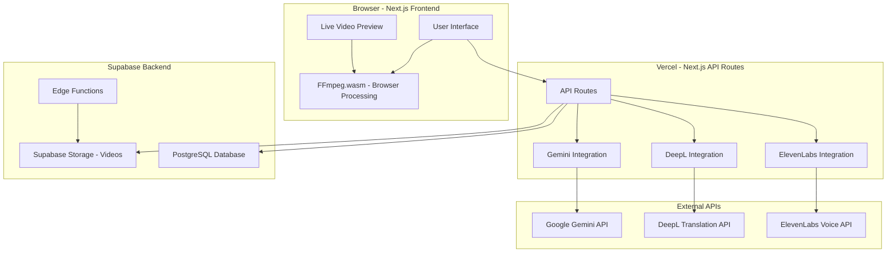
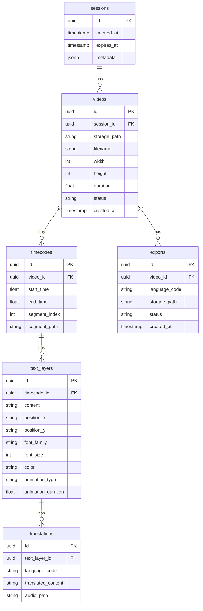
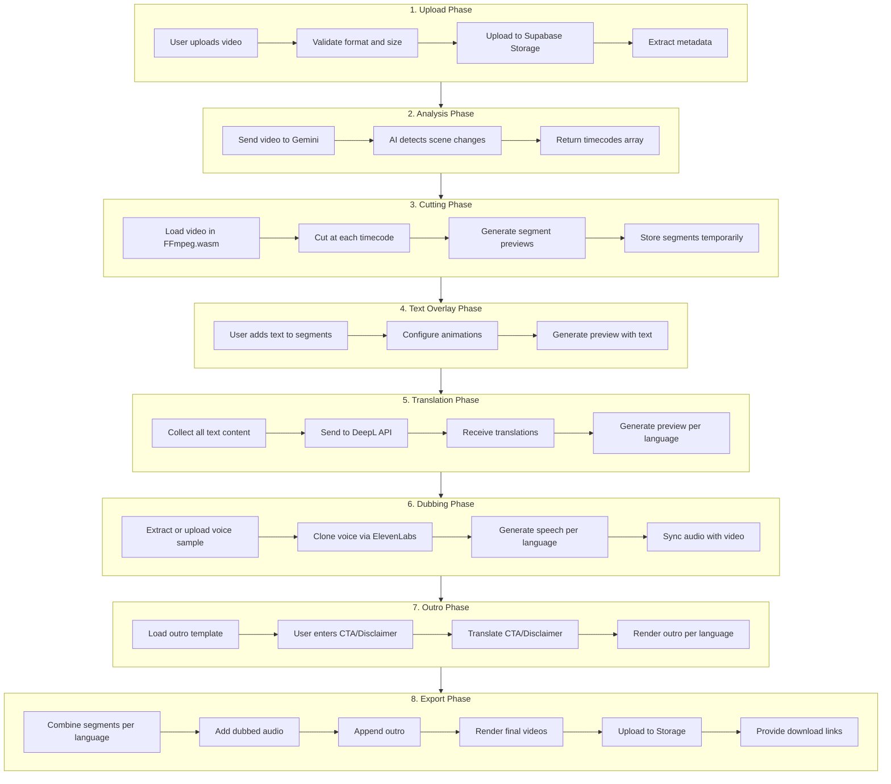
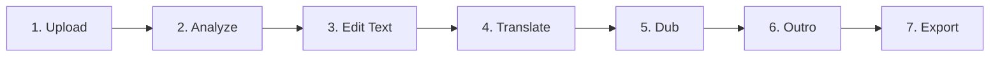

# POD Translation Automation - Architecture Plan

## Project Overview

A video automation tool that enables users to upload videos, automatically detect scene changes using AI, add text animations, translate content to multiple languages, generate voice dubbing, and export all translated versions.

---

## Requirements Summary

| Aspect | Decision |
|--------|----------|
| **Frontend** | Next.js 14+ with App Router |
| **Deployment** | Vercel (frontend) + Serverless FFmpeg processing |
| **Backend** | Supabase (Storage, Database, Edge Functions) |
| **Video Size** | Under 50MB (social media clips) |
| **Languages** | English, Spanish, Portuguese, Arabic (Kosha), French |
| **Text Animations** | Slide in from bottom (ease-in/out), Fade in/out |
| **Voice** | ElevenLabs voice cloning |
| **Export Resolutions** | 1080x1920, 1920x1080, 1080x1080, 1080x1350 |
| **Outro** | Pre-provided video + user CTA/Disclaimer (auto-translated) |
| **Auth** | Session-based, no login required |

---

## System Architecture



---

## User Flow Diagram

```mermaid
flowchart LR
    A[1. Upload Video] --> B[2. AI Scene Analysis]
    B --> C[3. Video Cutting]
    C --> D[4. Add Text Layers]
    D --> E[5. Select Languages]
    E --> F[6. Translation + Preview]
    F --> G[7. Voice Cloning Setup]
    G --> H[8. Generate Dubbing]
    H --> I[9. Add Outro/CTA]
    I --> J[10. Export All Videos]
```



---

## Detailed Workflow

### Step 1: Video Upload
- User uploads video file (max 50MB)
- Supported resolutions: 1080x1920, 1920x1080, 1080x1080, 1080x1350
- Video stored temporarily in Supabase Storage
- Extract video metadata (duration, resolution, fps)

### Step 2: AI Scene Analysis (Gemini)
- Send video to Gemini multimodal API
- Gemini analyzes video and identifies scene changes
- Returns array of timecodes marking scene transitions
- Example output: `[0.0, 3.5, 7.2, 12.8, 18.0]`

### Step 3: Video Cutting
- Use FFmpeg.wasm (browser) or server-side FFmpeg
- Cut video into segments based on timecodes
- Store segments temporarily for preview

### Step 4: Text Layer Addition
- Display all video segments in a timeline view
- User can add text overlays to each segment
- Text properties: content, position, font, size, color
- Animation options:
  - Slide in from bottom (ease-in/ease-out)
  - Fade in/out
- Live preview of text animations

### Step 5: Language Selection
- User selects target languages from:
  - English
  - Spanish
  - Portuguese
  - Arabic (Kosha)
  - French
- Multiple languages can be selected simultaneously

### Step 6: Translation + Preview
- Send all text layers to DeepL API
- Generate translations for each selected language
- Create live preview for each language version
- User can review and edit translations if needed

### Step 7: Voice Cloning Setup
- Option A: Extract voice sample from original video audio
- Option B: User uploads separate voice sample
- Send to ElevenLabs for voice cloning
- Create cloned voice profile

### Step 8: Generate Dubbing
- For each language version:
  - Send translated text to ElevenLabs
  - Generate speech using cloned voice
  - Sync audio with video segments
- Preview dubbed versions

### Step 9: Outro/CTA Addition
- Load pre-provided outro video template
- User enters CTA text and Disclaimer text
- Auto-translate CTA/Disclaimer to all selected languages
- Append outro to each language version

### Step 10: Export
- Render final videos for each language
- Include: original video + all translated versions
- Maintain original resolution
- Provide download links for all versions

---

## Database Schema (Supabase)



---

## API Integrations

### 1. Google Gemini API
**Purpose:** Analyze video for scene changes

```typescript
// Endpoint: POST /api/analyze-scenes
// Input: video file or URL
// Output: Array of timecodes

interface SceneAnalysisResponse {
  timecodes: number[];
  scenes: {
    startTime: number;
    endTime: number;
    description: string;
  }[];
}
```

### 2. DeepL API
**Purpose:** Translate text content

```typescript
// Endpoint: POST /api/translate
// Input: text content, source language, target languages
// Output: Translations for each language

interface TranslationRequest {
  texts: string[];
  sourceLang: string;
  targetLangs: string[]; // EN, ES, PT, AR, FR
}

interface TranslationResponse {
  translations: {
    [langCode: string]: string[];
  };
}
```

### 3. ElevenLabs API
**Purpose:** Voice cloning and text-to-speech

```typescript
// Endpoint 1: POST /api/clone-voice
// Input: audio sample
// Output: voice_id

// Endpoint 2: POST /api/generate-speech
// Input: text, voice_id, language
// Output: audio file

interface VoiceCloneResponse {
  voiceId: string;
  name: string;
}

interface SpeechGenerationRequest {
  text: string;
  voiceId: string;
  languageCode: string;
}
```

---

## Frontend Component Structure

```
src/
├── app/
│   ├── page.tsx                    # Main application page
│   ├── layout.tsx                  # Root layout
│   └── api/
│       ├── analyze-scenes/         # Gemini integration
│       ├── translate/              # DeepL integration
│       ├── clone-voice/            # ElevenLabs voice cloning
│       ├── generate-speech/        # ElevenLabs TTS
│       ├── process-video/          # FFmpeg processing
│       └── export/                 # Final video export
├── components/
│   ├── upload/
│   │   └── VideoUploader.tsx       # Drag-drop video upload
│   ├── timeline/
│   │   ├── Timeline.tsx            # Video segments timeline
│   │   ├── Segment.tsx             # Individual segment
│   │   └── Timecode.tsx            # Timecode markers
│   ├── editor/
│   │   ├── TextLayerEditor.tsx     # Add/edit text layers
│   │   ├── AnimationPicker.tsx     # Select animations
│   │   └── StyleControls.tsx       # Font, color, position
│   ├── preview/
│   │   ├── VideoPreview.tsx        # Live video preview
│   │   ├── LanguageTabs.tsx        # Switch between languages
│   │   └── PreviewControls.tsx     # Play, pause, seek
│   ├── translation/
│   │   ├── LanguageSelector.tsx    # Multi-select languages
│   │   ├── TranslationPanel.tsx    # View/edit translations
│   │   └── TranslationStatus.tsx   # Progress indicator
│   ├── dubbing/
│   │   ├── VoiceCloneSetup.tsx     # Voice sample upload
│   │   ├── DubbingProgress.tsx     # Generation progress
│   │   └── AudioPreview.tsx        # Preview dubbed audio
│   ├── outro/
│   │   ├── OutroEditor.tsx         # CTA and Disclaimer input
│   │   └── OutroPreview.tsx        # Preview outro
│   └── export/
│       ├── ExportPanel.tsx         # Export options
│       ├── ExportProgress.tsx      # Rendering progress
│       └── DownloadLinks.tsx       # Download all versions
├── hooks/
│   ├── useVideoUpload.ts           # Upload handling
│   ├── useFFmpeg.ts                # FFmpeg.wasm operations
│   ├── useTranslation.ts           # DeepL API calls
│   ├── useVoiceClone.ts            # ElevenLabs operations
│   └── useExport.ts                # Export handling
├── lib/
│   ├── supabase.ts                 # Supabase client
│   ├── gemini.ts                   # Gemini API client
│   ├── deepl.ts                    # DeepL API client
│   ├── elevenlabs.ts               # ElevenLabs API client
│   └── ffmpeg.ts                   # FFmpeg utilities
├── types/
│   └── index.ts                    # TypeScript interfaces
└── utils/
    ├── timecode.ts                 # Timecode formatting
    ├── video.ts                    # Video utilities
    └── constants.ts                # App constants
```

---

## Video Processing Pipeline



---

## Technology Stack

| Layer | Technology | Purpose |
|-------|------------|---------|
| **Frontend** | Next.js 14+ | React framework with App Router |
| **Styling** | Tailwind CSS | Utility-first CSS |
| **UI Components** | shadcn/ui | Pre-built accessible components |
| **Animations** | Framer Motion | Smooth UI transitions and micro-interactions |
| **State Management** | Zustand | Lightweight state management |
| **Video Preview** | React Player | Video playback component |
| **Video Processing** | FFmpeg.wasm | Browser-based video processing |
| **Backend** | Supabase | Database, Storage, Edge Functions |
| **AI Analysis** | Google Gemini | Multimodal video analysis |
| **Translation** | DeepL API | High-quality translations |
| **Voice** | ElevenLabs | Voice cloning and TTS |
| **Deployment** | Vercel | Frontend hosting |

---

## UI/UX Design Guidelines - Modern 2025 Trends

### Design Philosophy
Modern, clean, and professional interface inspired by tools like **Descript**, **Runway ML**, **CapCut Pro**, and **Figma**. The design follows current 2025 trends: dark-mode-first, glassmorphism, subtle gradients, generous spacing, and smooth micro-interactions.

### Color Scheme - Dark Mode First

```
Primary Colors:
  --background:          #0a0a0b     Deep black background
  --surface:             #141416     Card/panel background
  --surface-elevated:    #1c1c1f     Elevated elements, modals
  --border:              #2a2a2d     Subtle borders

Accent Colors:
  --primary:             #6366f1     Indigo - primary actions
  --primary-hover:       #818cf8     Lighter indigo on hover
  --secondary:           #22d3ee     Cyan - secondary highlights
  --success:             #22c55e     Green - success states
  --warning:             #f59e0b     Amber - warnings
  --error:               #ef4444     Red - errors

Text Colors:
  --text-primary:        #fafafa     Primary text
  --text-secondary:      #a1a1aa     Secondary text
  --text-muted:          #71717a     Muted/disabled text

Gradients:
  --gradient-primary:    linear-gradient 135deg, #6366f1 0%, #8b5cf6 100%
  --gradient-accent:     linear-gradient 135deg, #22d3ee 0%, #6366f1 100%
  --gradient-glow:       radial-gradient circle, rgba 99,102,241,0.15 0%, transparent 70%
```

### Typography

```
Font Family:
  --font-sans:  Inter, system-ui, sans-serif
  --font-mono:  JetBrains Mono, monospace

Font Scale:
  12px  - labels, captions, badges
  14px  - body small, secondary text
  16px  - body default
  18px  - body large, emphasis
  20px  - section headings
  24px  - page section titles
  30px  - page titles
  36px  - hero text
```

### UI Component Styling

**Cards and Panels:**
- Rounded corners: 12px to 16px
- Subtle 1px borders with low opacity
- Glassmorphism effect on overlays: backdrop-blur 12px
- Soft colored glow shadows on hover
- Smooth 300ms transitions

**Buttons:**
- Primary: gradient background, 8px radius, slight scale on hover 1.02, glow effect
- Secondary: transparent with border, hover fills background
- Ghost: no border, hover shows subtle background
- Icon buttons: 40x40px, 10px radius, tooltip on hover

**Input Fields:**
- Background: surface color
- Border: 1px solid, focus changes to primary color
- Border-radius: 8px
- Focus ring: 2px primary with 20% opacity
- Placeholder text in muted color

### Application Layout

```
+------------------------------------------------------------------+
|  HEADER: Logo | Step Wizard Progress Bar | Settings               |
+------------------------------------------------------------------+
|                          |                                        |
|                          |         CONTROL PANEL                  |
|    MAIN PREVIEW          |         Context-aware sidebar          |
|    Video Player          |                                        |
|    with text overlay     |         - Text Editor                  |
|                          |         - Language Selector             |
|                          |         - Voice Settings                |
|                          |         - Export Options                |
|                          |                                        |
+------------------------------------------------------------------+
|  TIMELINE: Segments | Text Layers | Audio Waveform | Playhead     |
+------------------------------------------------------------------+
```

### Step-Based Wizard Navigation

The app uses a horizontal step wizard at the top showing progress through the workflow:



- Completed steps: filled with primary color + checkmark
- Current step: highlighted with glow effect
- Future steps: muted/dimmed
- Clickable to navigate back to completed steps

### Key UI Screens

#### Screen 1: Upload
- Large centered drag-and-drop zone with dashed animated border
- Pulsing upload icon
- Supported formats and size limit displayed
- Progress bar with percentage during upload
- Video thumbnail preview after upload with metadata overlay

#### Screen 2: Scene Analysis
- Full-width video player showing analysis progress
- AI processing animation with shimmer effect
- Detected scenes appear as cards below with thumbnails
- Timecode markers on a mini-timeline
- User can adjust/add/remove timecodes manually

#### Screen 3: Text Layer Editor
- Split view: video preview left, text controls right
- WYSIWYG text positioning - drag handles on video
- Property panel:
  - Font family dropdown with preview
  - Font size slider
  - Color picker with preset palette
  - Animation type selector with mini previews
  - Timing controls: start time, duration
- Segment navigation: prev/next with thumbnails

#### Screen 4: Translation
- Language selection grid with flag icons and checkboxes
- Selected languages shown as colored pills/tags
- Side-by-side panels: original text vs translated text
- Inline editing for translation corrections
- Character count and text fit indicator
- Regenerate button per translation

#### Screen 5: Voice Dubbing
- Audio waveform visualization of original
- Voice sample upload or extract from video
- Clone quality indicator with progress
- Per-language audio preview with play buttons
- Volume and timing adjustment controls

#### Screen 6: Outro Editor
- Outro video preview
- CTA text input with live preview overlay
- Disclaimer text input with live preview overlay
- Auto-translated versions shown in tabs per language
- Position and style controls for CTA/Disclaimer text

#### Screen 7: Export Dashboard
- Grid of all language versions as cards
- Each card: thumbnail, language flag, status badge
- Individual download buttons per version
- Bulk download all as ZIP
- Progress bars during rendering
- Estimated time remaining

### Micro-interactions and Animations

Using **Framer Motion** for all UI animations:

**Page Transitions:**
- Fade + slide up on enter, fade + slide down on exit
- Duration: 300ms, ease-out

**Button Interactions:**
- Hover: scale 1.02 with 200ms transition
- Active: scale 0.98
- Primary buttons: subtle glow pulse on hover

**Card Interactions:**
- Hover: lift up 4px with colored shadow
- Duration: 300ms

**Loading States:**
- Skeleton loaders with shimmer animation
- Pulsing opacity 0.5 to 1.0, 1.5s loop
- Spinner with contextual message

**Stagger Animations:**
- List items appear with 100ms stagger delay
- Cards in grid appear with stagger

**Toast Notifications:**
- Slide in from top-right
- Auto-dismiss after 5 seconds
- Color-coded: success green, error red, info blue

### Responsive Breakpoints

```
Desktop  1440px+   Full layout with side panel
Laptop   1024px    Compact side panel
Tablet   768px     Stacked layout, collapsible panels
Mobile   < 768px   Basic support, simplified UI
```

Primary target is desktop/laptop. Mobile is secondary.

### Accessibility

- WCAG 2.1 AA compliance
- Keyboard navigation for all interactive elements
- Visible focus indicators
- Screen reader labels on all controls
- Reduced motion preference respected
- Sufficient color contrast ratios
- Tooltips on icon-only buttons

### Empty and Error States

**Empty States:**
- Illustrated graphics with clear call-to-action
- Helpful tips and guidance text
- Quick action buttons

**Error States:**
- Inline validation with red border and message
- Toast notifications for API errors
- Retry buttons with clear messaging
- Graceful fallback UI for failed components

---

## Environment Variables

```env
# Supabase
NEXT_PUBLIC_SUPABASE_URL=your_supabase_url
NEXT_PUBLIC_SUPABASE_ANON_KEY=your_supabase_anon_key
SUPABASE_SERVICE_ROLE_KEY=your_service_role_key

# Google Gemini
GEMINI_API_KEY=your_gemini_api_key

# DeepL
DEEPL_API_KEY=your_deepl_api_key

# ElevenLabs
ELEVENLABS_API_KEY=your_elevenlabs_api_key
```

---

## Implementation Phases

### Phase 1: Project Setup & Core Infrastructure
- Initialize Next.js project with TypeScript
- Set up Tailwind CSS and shadcn/ui
- Configure Supabase client and database schema
- Set up environment variables
- Create basic layout and navigation

### Phase 2: Video Upload & Storage
- Build video uploader component
- Implement file validation (size, format, resolution)
- Set up Supabase Storage buckets
- Create video metadata extraction

### Phase 3: AI Scene Analysis
- Integrate Gemini API
- Build scene analysis endpoint
- Display timecodes to user
- Allow manual timecode adjustment

### Phase 4: Video Cutting & Timeline
- Set up FFmpeg.wasm
- Implement video cutting logic
- Build timeline component
- Create segment preview system

### Phase 5: Text Layer Editor
- Build text layer editor component
- Implement text positioning system
- Create animation system (slide, fade)
- Live preview with text overlays

### Phase 6: Translation System
- Integrate DeepL API
- Build language selector
- Create translation panel
- Generate per-language previews

### Phase 7: Voice Cloning & Dubbing
- Integrate ElevenLabs API
- Build voice clone setup
- Implement speech generation
- Audio-video synchronization

### Phase 8: Outro & CTA
- Build outro editor
- Implement CTA/Disclaimer input
- Auto-translate outro text
- Preview outro per language

### Phase 9: Export System
- Build export pipeline
- Implement progress tracking
- Generate all language versions
- Create download system

### Phase 10: Polish & Testing
- Error handling and validation
- Loading states and feedback
- Performance optimization
- Cross-browser testing

---

## File Structure (Complete Project)

```
pod-translation-automation/
├── .env.local                      # Environment variables
├── .gitignore
├── next.config.js
├── package.json
├── tailwind.config.js
├── tsconfig.json
├── public/
│   ├── outro/                      # Pre-provided outro videos
│   │   ├── outro-1080x1920.mp4
│   │   ├── outro-1920x1080.mp4
│   │   ├── outro-1080x1080.mp4
│   │   └── outro-1080x1350.mp4
│   └── fonts/                      # Custom fonts if needed
├── src/
│   ├── app/                        # Next.js App Router
│   ├── components/                 # React components
│   ├── hooks/                      # Custom hooks
│   ├── lib/                        # API clients and utilities
│   ├── types/                      # TypeScript types
│   └── utils/                      # Helper functions
└── plans/                          # Planning documents
    └── architecture-plan.md        # This file
```

---

## Risk Considerations

1. **FFmpeg.wasm Performance**: Browser-based video processing may be slow for complex operations. Consider fallback to server-side processing for heavy tasks.

2. **API Rate Limits**: Gemini, DeepL, and ElevenLabs have rate limits. Implement queuing and error handling.

3. **Large File Handling**: Even with 50MB limit, ensure proper chunked uploads and progress feedback.

4. **Voice Cloning Quality**: ElevenLabs voice cloning requires good quality audio samples. Provide guidance to users.

5. **Translation Accuracy**: DeepL is high quality but may need human review for specialized content.

6. **Browser Compatibility**: FFmpeg.wasm requires modern browsers with SharedArrayBuffer support.

---

## Next Steps

1. Review and approve this architecture plan
2. Switch to Code mode to begin implementation
3. Start with Phase 1: Project Setup & Core Infrastructure
