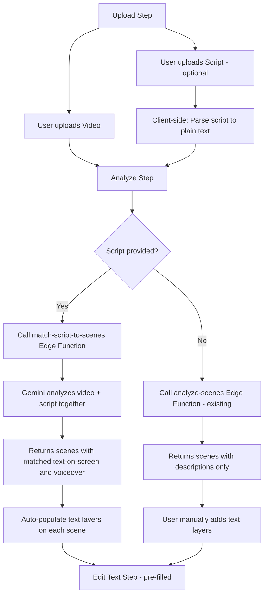

# Script Upload & AI Auto-Populate Feature Plan

## Overview

Add the ability to upload a script file (TXT, PDF, DOCX) alongside the video during the upload step. The AI will analyze both the video scenes and the script content, then intelligently match script entries to detected scenes and auto-populate text layers in the Edit Text step.

## Current Architecture

The app follows a step-based wizard flow:

1. **Upload** → Video file upload with drag-and-drop
2. **Analyze** → AI scene detection via Gemini (Supabase Edge Function)
3. **Edit Text** → Manual text layer creation per scene
4. **Translate** → Language selection
5. **Dub** → Voice cloning
6. **Outro** → CTA/Disclaimer
7. **Export** → Download

Key files:
- [`page.tsx`](../pod-translation-app/src/app/page.tsx) — All step content components in one file
- [`types/index.ts`](../pod-translation-app/src/types/index.ts) — Type definitions
- [`store/app-store.ts`](../pod-translation-app/src/store/app-store.ts) — Zustand state management
- [`lib/supabase.ts`](../pod-translation-app/src/lib/supabase.ts) — Supabase client and edge function helpers
- [`functions/analyze-scenes/index.ts`](../supabase/functions/analyze-scenes/index.ts) — Gemini-based scene analysis

## Feature Design

### Data Flow



### Architecture Decisions

1. **Client-side script parsing**: Parse PDF/DOCX to plain text on the client using `mammoth` for DOCX and `pdfjs-dist` for PDF. This avoids sending binary files to the edge function — we only send the extracted text.

2. **Enhanced Edge Function**: Create a new `match-script-to-scenes` edge function that receives both the video URL and the script text. It uses Gemini to analyze the video AND match script content to scenes simultaneously.

3. **Backward compatible**: Script upload is optional. If no script is provided, the existing `analyze-scenes` flow works unchanged.

4. **Voiceover as reference**: The voiceover text from the script is stored in the scene data for reference but does not feed into the dubbing pipeline.

### New Types

```typescript
// Script file uploaded by user
interface ScriptFile {
    id: string;
    file: File;
    name: string;
    size: number;
    type: 'txt' | 'pdf' | 'docx';
    extractedText: string; // Plain text extracted from the file
}

// AI-matched script entry for a scene
interface ScriptEntry {
    sceneIndex: number;
    textOnScreen: string;      // Text to display as overlay
    voiceover: string;         // Voiceover reference text
    position: 'top' | 'center' | 'bottom'; // Suggested position
    fontSize: 'small' | 'medium' | 'large'; // Suggested size
}

// Enhanced scene analysis response when script is provided
interface ScriptMatchResponse {
    timecodes: number[];
    scenes: {
        startTime: number;
        endTime: number;
        description: string;
        textOnScreen?: string;
        voiceover?: string;
        suggestedPosition?: 'top' | 'center' | 'bottom';
    }[];
}
```

### Store Changes

Add to [`app-store.ts`](../pod-translation-app/src/store/app-store.ts):

```typescript
// New state fields
script: ScriptFile | null;
setScript: (script: ScriptFile | null) => void;
scriptEntries: ScriptEntry[];
setScriptEntries: (entries: ScriptEntry[]) => void;
```

### UI Changes

#### Upload Step
- Add a secondary drop zone or file input below the video upload for script files
- Accept `.txt`, `.pdf`, `.docx` formats
- Show script preview with extracted text
- Script upload is clearly marked as optional

#### Analyze Step
- When script is present, the AI Auto-Detect button label changes to "AI Auto-Detect with Script"
- The analysis sends both video URL and script text to the enhanced edge function
- After analysis, scenes show matched text-on-screen content in the scene list

#### Edit Text Step
- When scenes have matched script entries, text layers are auto-created when entering this step
- Each auto-created text layer uses the `textOnScreen` from the matched script entry
- Position and font size use AI-suggested values
- Voiceover text is shown as a read-only reference below each scene
- Users can still edit, delete, or add more text layers manually

### New Edge Function: match-script-to-scenes

Located at `supabase/functions/match-script-to-scenes/index.ts`

This function:
1. Receives `videoUrl`, `videoDuration`, and `scriptText`
2. Uploads video to Gemini File API (same as analyze-scenes)
3. Sends a combined prompt asking Gemini to:
   - Detect scene cuts in the video
   - Parse the script to identify text-on-screen and voiceover entries
   - Match each script entry to the appropriate video scene
   - Return structured JSON with scenes, matched text, and suggested positions
4. Returns the enhanced scene data

### Dependencies to Add

- `pdfjs-dist` — PDF text extraction on the client
- `mammoth` — DOCX to plain text conversion on the client

Both are well-maintained, browser-compatible libraries.

## Implementation Steps

1. **Types**: Add `ScriptFile`, `ScriptEntry`, `ScriptMatchResponse` to [`types/index.ts`](../pod-translation-app/src/types/index.ts)
2. **Store**: Add script state fields to [`app-store.ts`](../pod-translation-app/src/store/app-store.ts)
3. **Dependencies**: Install `pdfjs-dist` and `mammoth`
4. **Script Parser**: Create [`src/lib/script-parser.ts`](../pod-translation-app/src/lib/script-parser.ts) with functions to extract text from TXT/PDF/DOCX
5. **Edge Function**: Create [`supabase/functions/match-script-to-scenes/index.ts`](../supabase/functions/match-script-to-scenes/index.ts)
6. **Supabase Helper**: Add `matchScriptToScenes()` function to [`lib/supabase.ts`](../pod-translation-app/src/lib/supabase.ts)
7. **Upload UI**: Add script upload section to `UploadStepContent` in [`page.tsx`](../pod-translation-app/src/app/page.tsx)
8. **Analyze Logic**: Update `AnalyzeStepContent` to use the new edge function when script is available
9. **Auto-populate**: Update `EditTextStepContent` to auto-create text layers from matched script entries
10. **Testing**: End-to-end verification
